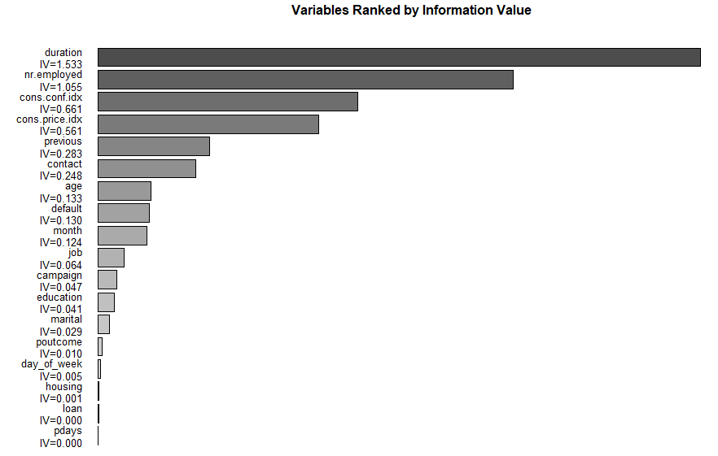
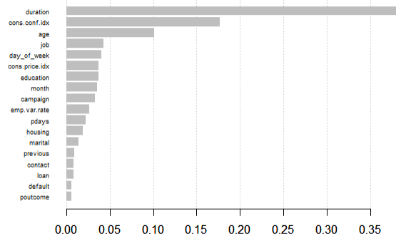

```{r setup, include=FALSE, message=FALSE, warning=FALSE}
knitr::opts_chunk$set(echo = TRUE)
library(h2o)
h2o.no_progress()
```

#Objective
The main task here is predicting whether the client will subscribe to a term deposit. To achieve that we have several small tasks, and they are as follow,<br />
1. Preliminary analysis to get an overlook of the data <br />
2. Preparing data for building model <br />
3. Model fiting and tunning <br />
4. Model validation

#Data Preparation


##Reading Raw Data

```{r}
raw_data = read.csv("bank-additional-train.csv")
```

```{r, message=FALSE, warning=FALSE, echo = FALSE}
##loading data and library
library(xgboost) # for xgboost
library(tidyverse) # general utility functions
library(corrplot)
library(caret)
library(woeBinning)
library(ROCR)
library(ROSE)
library(pROC)
library(DMwR)
library(ggcorrplot)
library(plyr)
```


##Reading Data with H2o##
```{r, message=FALSE, warning=FALSE, include = FALSE}
set.seed(1)
library(Rlab)
library(h2o)
h2o.init()
```

```{r}
df = h2o.importFile(path = normalizePath("bank-additional-train.csv"))
```

The implemented statistical package are listed above and the data was successfully read


##Preliminary Analysis

$\\------- Table\ for\ statistics\ of\ y -------\\$
```{r}
table(raw_data$y)
```

$\\------- Summary\ of\ each\ predictor -------\\$
```{r}
summary(raw_data)
```

$\\------- The\ existence\ of\ NA\ value\ is: -------\\$
```{r}
any(is.na(raw_data))
```

In this step, we are trying to make a summary table of data in order to bring the data statistics in an intuitional way.

From the result above we know that the data is highly imbalanced, which suggests that we might need to do oversampling or undersampling later. Also from the summary of the data we can see that we have 10 categorical variables and 10 numeric variables, which suggest that we might want to recode categorical data into dummy variables in the future for some model fitting. Besides, we don't have any missing value in the dataset.

$\\------- Data\ Explore -------\\$

```{r}
yes_idx=which(raw_data$y=="yes")
yes_data=raw_data[yes_idx,]

(table_job=sort(table(yes_data$job),decreasing=T))
(table_marital=sort(table(yes_data$marital),decreasing=T))
(table_education=sort(table(yes_data$education),decreasing=T))
(table_default=sort(table(yes_data$default),decreasing=T))
(table_housing=sort(table(yes_data$housing),decreasing=T))
(table_contact=sort(table(yes_data$contact),decreasing=T))
(table_month=sort(table(yes_data$month),decreasing=T))
(table_day_of_week=sort(table(yes_data$day_of_week),decreasing=T))
(table_poutcome=sort(table(yes_data$poutcome),decreasing=T))
```

This is a data exploration for people who subscripe. From the result above, we can see that people who subscript are more likely to have an administration job, married, have an university degree, has home load, do not have credit in default, and was contacted by cellphone.

##Data Type Conversion
```{r}
#Convert non-numeric predictor to numeric for the process of redundant data removal

fac_var = c("job","marital","education","default","housing","loan","contact","month","day_of_week","poutcome","y")
convert = function(dat){
  t = as.numeric(raw_data[,dat])
  return (t)
}

data = raw_data
for (i in fac_var){
  data[,i] = convert(i)
}
data[,"y"] = factor(data[,"y"])

```

Since the predictors are potentially highly correlated with each other, there might be some redundant information that needs to be removed regarding the elimination of noise. We decided to make the correlation table to see what might be the redundant variables. In order to do so, we need to transform our variables as numeric variables. 


##Correlation Graph

```{r, message = FALSE, warning=FALSE, echo = FALSE}
o = data
o[,"y"] = as.numeric(o[,"y"])
ggcorrplot(cor(o), p.mat = cor_pmat(o), hc.order=TRUE, type='lower', title = "Correlation Graph")

```


##Correlation Demonstration

```{r}
#Eliminate highly correlated data
par(mfrow=c(1,3))

corr = corrplot(cor(data[,-21]), order = "hclust")

highlyCorrelated <- findCorrelation(corr, cutoff=0.75, name = TRUE)

corr1 = corrplot(cor(subset( data, select = -c(16, 21 ) )), order = "hclust")

highlyCorrelated1 <- findCorrelation(corr1, cutoff=0.75, name = TRUE)

corr2 = corrplot(cor(data[,c(-16,-19,-21)]), order = "hclust")

highlyCorrelated2 <- findCorrelation(corr2, cutoff=0.75, verbose = TRUE, name = TRUE)

bank_new = data[,c(-16,-19)]
```

After the data type transformation, we generated the correlation plot and tried to find the highly correlated predictors. The cutoff is setted as 0.75, which is a common level for identifying high correlation. Later, we removed the predictor once at a time. Column number 16 and 19 are considered as redudant columns. 


##Information Value Comparison
The information value are calculated based on the following formula
$$
IV = \Sigma (\% \ of \ \ nonevents - \%\ of\ events) * WOE
$$

```{r, warning=FALSE, message=FALSE, echo = FALSE}

# WoE
binning <- woe.binning(bank_new, 'y', bank_new)
#
woe.binning.plot(binning)

```


Information value is one of the most useful technique to select important variables in a predictive model. It helps to rank variables on the basis of their importance, by way of example, higher information value is equivalent to higher predictive power.

The information values are shown above, the "Duration" variable is obviously the most influential variable and pdays does not perform well in the potential model with the lowest score. However, "duration" won't help us much in the prediction task as mentioned in the data description of the competition, and we will only use it for benchmark and remove it for actual model fitting.




##Importance




Other than the information value, in order to be certain about the importance of predictors, this importance plot indicates that duration also has the most significant impact. However, the rank of some predictors, such as pdays, has changed. Regarding the ranking changes, it is not surprising because a different algorithm will generate a relatively different result. Notably, their position of ranking does not change much, namely, they stay at the same level. For instance, the pdays is still the least important variable and will be removed due to its meaningless. 

```{r}
#Comparison and integration
#Remove noise for better training
data_new = bank_new[,-c(13,7,6,15,3)]

df = as.h2o(data_new)
```

Take the previous statement into account, we decided to discard columns of 3,6,7,13,15.

From here, we completed the process of data preparation.

#Model training

Before actually deploying different algorithms, we first define several terminologies.

TN / True Negative: case was negative and predicted negative
TP / True Positive: case was positive and predicted positive
FN / False Negative: case was positive but predicted negative
FP / False Positive: case was negative but predicted positive

In this specific case, the negative regarding y = "no", while the positive refers to y = "yes"

$$Precision = {\frac{TP}{FP + TP}}  $$

$$Accuracy = {\frac{TN + TP}{FN + FP}}  $$
$$Recall = {\frac{TP}{TP + FN}}  $$


##Performance Metrics Selection
As we discovered before, the dataset is highly imbalanced, so simply looking at accuracy won¡¯t tell us too much about how good the model is performing. In our case, we choose to choose the model based on the precision of prediction yes. And we will display ROC and AUC for our final model as well.


##Including "Duration" for Benchmark##
```{r, echo = FALSE}
splits <- h2o.splitFrame(
  df,          
  c(0.6,0.2), seed=1234)    

train <- h2o.assign(splits[[1]], "train.hex")   
valid <- h2o.assign(splits[[2]], "valid.hex")   
test <- h2o.assign(splits[[3]], "test.hex") 
rf_ben <- h2o.randomForest(        
  training_frame = train,        ## the H2O frame for training
  validation_frame = valid,      ## the H2O frame for validation (not required)
  x=1:13,                        ## the predictor columns, by column index
  y=14,                          ## the target index (what we are predicting)
  ntrees = 200,                  ## use a maximum of 200 trees to create the
                                 ##  random forest model. The default is 50.
                                 ##  I have increased it because I will let 
                                 ##  the early stopping criteria decide when
                                 ##  the random forest is sufficiently accurate
  stopping_rounds = 2,           ## Stop fitting new trees when the 2-tree
                                 ##  average is within 0.001 (default) of 
                                 ##  the prior two 2-tree averages.
                                 ##  Can be thought of as a convergence setting
  score_each_iteration = T,      ## Predict against training and validation for
                                 ##  each tree. Default will skip several.
  seed = 1000000)                ## Set the random seed so that this can be
                                 ##  reproduced.                  
```

$\\------- Benchmarked\ Random\ Forest\ model\ summary -------\\$
```{r}
rf_ben@model$validation_metrics  
```

$\\------- Benchmarked\ Random\ Forest\ model\ percision -------\\$

```{r}
##prediciont
finalRf_predictions<-h2o.predict(
  object = rf_ben
  ,newdata = test)

pred=finalRf_predictions[,1]
test_label=test$y
(precision=sum(pred[test_label=="2"]=="2")/(sum(pred[test_label=="2"]=="2")+sum(pred[test_label=="1"]=="2")))
```

From the result above we know that duration is highly influential for the prediction task, give with that variable, we are able to get 0.52888 precision for predicting yes even without tuning the model. However, as the task mentioned, we shouldn't use "duration" for prediction. The following are models we used without variable "duration"

##Excluding Duration and Training Model

```{r}
##excluding duration 
data_new=df
data_new=data_new[,-which(names(data_new) == "duration")]
## train valid test split, 60% trianing, 20% validation, 20% testing
splits <- h2o.splitFrame(
  data_new,          
  c(0.6,0.2), seed=1234)    

train <- h2o.assign(splits[[1]], "train.hex")   
valid <- h2o.assign(splits[[2]], "valid.hex")   
test <- h2o.assign(splits[[3]], "test.hex")     
```

The processed and manipulated data are prepared, then we move forward to slip the data into train and test for cross-validation, a popular method that often use in predicting of machine learning problem, we test-train divide the data with 60% of them are training data, 20% of them are validation data and the rest are testing data. 

###Oversampling

As discussed before, the approach of oversampling or undersampling will be implemented below because of the imbalanced label. Eventually, We decided to oversample the response variable in our training set, so that we have balanced counts of "yes" and "no" as our response in order to build a stronger classifier.

```{r}
##doing oversample for training set
train=as.data.frame(train)
train = SMOTE(y ~ ., train, perc.over = 700,perc.under=100)
temp_trn = train
train=as.h2o(train)
table(temp_trn$y)
```
From the result above we can see that the training set is balanced now.

###Model Training Without "Duration"

```{r, echo = FALSE}

## run our first predictive model
rf1 <- h2o.randomForest(        
  training_frame = train,        ## training
  validation_frame = valid,      ## validation 
  x=1:12,                        ## the predictor columns
  y=13,                          ## the target index 
  ntrees = 200,                  ## use a maximum of 200 trees to create the
                                 ##  random forest model
                                 ##  each tree. Default will skip several.
  seed = 1000000)                ## Set the random seed 

```

$\\------- Random\ Forest\ Evaluation\ Results ------- \\$

```{r}
rf1@model$validation_metrics    
```

After getting out first random forest model, we have several ways to tune to model<br />
1: Adding trees will help. The default is 50.<br />
2: changing the depth will help.Changing the depth means you are adjusting the "weakness" of each learner. Adding depth makes each tree fit the data closer, and vice versa.

```{r, echo = FALSE}
rf2 <- h2o.randomForest(        ##
  training_frame = train,       ##
  validation_frame = valid,     ##
  x=1:12,                       ##
  y=13,                         ##
  model_id = "rf_covType2",     ## 
  ntrees = 250,                 ## increase tree, from 200
  max_depth = 10,               ## decrease depth, from 20    ##
  seed=3000000)                 ##
```

$\\------- Random\ Forest\ Evaluation\ Results ------- \\$

```{r, echo = FALSE}
rf2@model$validation_metrics 
```

From the result above, we can see that error rate for predicting yes is 0.476, which is getting smaller, indicating that we are getting to the right direction


```{r, echo = FALSE}
## Now we will try GBM. 
## First we will use all default settings, and then make some changes,
##  where the parameters and defaults are described.

gbm1 <- h2o.gbm(
  training_frame = train,        ## the H2O frame for training
  validation_frame = valid,      ## the H2O frame for validation (not required)
  x=1:12,                        ## the predictor columns, by column index
  y=13,                          ## the target index (what we are predicting)
  model_id = "gbm_covType1",     ## name the model in H2O
  seed = 2000000)                ## Set the random seed for reproducability
```


$\\------- Gradient\ Boosting\ Machine\ 1\ Evaluation\ Results ------- \\$

```{r, echo = FALSE}
gbm1@model$validation_metrics 

```

The default gbm model has 0.46 validation error for prediction yes

```{r, echo = FALSE}
gbm2 <- h2o.gbm(
  training_frame = train,     ##
  validation_frame = valid,   ##
  x=1:12,                     ##
  y=13,                       ## 
  ntrees = 50,               ## decrease the trees                          
  learn_rate = 0.05,           ## increase the learning rate (from 0.1)
  max_depth = 8,              ## decrease the depth (from 5)
  model_id = "gbm_covType2",  ##
  seed = 2000000)             ##
```

$\\------- Gradient\ Boosting\ Machine\ 2\ Evaluation\ Results ------- \\$
```{r, echo = FALSE}
gbm2@model$validation_metrics 
```
The tuned gbm model has 0.47 validation error for prediction yes


The deep learning algorithms are getting popular nowsdays, and we applied a simple neurons network model with activation function of Tanh and dropout (avoid overfitting).

```{r, echo = FALSE}
nn = h2o.deeplearning(training_frame = train,     ##
  validation_frame = valid,   ##
   activation = "TanhWithDropout", # or 'Tanh'
  input_dropout_ratio = 0.1,#input_dropout_ratio = 0.1, # % of inputs dropout
  hidden_dropout_ratios = c(0.2,0.1,0.1,0.1), # % for nodes dropout
  balance_classes = FALSE, #no and yes are not balanced
  
  hidden = c(150,100,100,50), # four layers
  epochs = 1000000, # max. no. of epochs
  x=1:12,                     ##
  y=13)  
```

$\\------- Deep\ Learning\ Evaluation\ Results ------- \\$

```{r, echo = FALSE}
nn@model$validation_metrics 
```

$\\------- Overall\ Models\ Evaluation\ Results ------- \\$


```{r, echo=FALSE}
results = data.frame(
  c("RF1", "RF2", "GBM1", "GBM2", "Deep Learning (neurons network)"),
c(0.55555,0.476023,0.461988,0.463158, 0.474751),
c(0.083473,0.088946,0.090923, 0.092747,0.110841),
c(0.133477,0.133611,0.135361,0.135361,0.152718),
c(380/929,448/1033,460/1058,459/1069,449/1178),
c((6028+380)/7432,(5992+448)/7432,(5979+460)/7432,(5967+459)/7432,(5848+449)/7432),
c(0.7482088,0.775447,0.778049,0.7672464,0.7412937))
colnames(results) = c("Models","'Yes' prediction error", 
                      "'No' prediction error", 
                      "Total error", 
                      "Precision",
                      "Accuracy",
                      "AUC")
rownames(results) = NULL
knitr::kable(results)
```

#Best Model Performance in Test Data

Based on the validation error, we choose the tuned gbm model as our best model, the following is the performance of tuned gmb in test set.

```{r, echo = FALSE}
##prediciont
finalRf_predictions<-h2o.predict(
  object = gbm2
  ,newdata = test)

pred=finalRf_predictions[,1]
test_label=test$y
(precision=sum(pred[test_label=="2"]=="2")/(sum(pred[test_label=="2"]=="2")+sum(pred[test_label=="1"]=="2")))
```


```{r, echo = FALSE}
##roc curve
library(ROCR)
roc=prediction(as.data.frame(as.numeric(((pred)))),as.data.frame(as.numeric(((test_label)))))
roc_perf=performance(roc,"tpr","fpr")
plot(roc_perf,main="roc curve")
auc=performance(roc,"auc")
```


```{r, echo = FALSE}
auc@y.values[[1]]
```
From the result above, we can see that the tuned GBM model has 0.446 precision for predicting yes in test set, with auc value of 0.733.

#Discussion

Even though the final model was chosen, the further conversation about this project is not end. The previous experiences illustrate that the factors of predictors might take the different contribution to the model, say, let's take a virtual example, we want to predict the number of transactions in a store based on transaction dates. Here transaction dates may not have direct correlation with number of transactions, but if we look at the day of a week, it may have a higher correlation. In this case, the information about day of a week is hidden. We need to extract it to make the model better.

As the data exploration part shows, there are intuitively significant different statistics of each factor variables, such as month. From an overlook, December has the lowest amount of subscriptions month, comparison with other months. Another example would be the poutcome, the amount of nonexistent is more than five times than failure and approximately 3 times than the success. We cannot say there MUST be a relationship between these factors and dependent variable, rather, it means that the data at least brings us a new way to understand the connections. We believe that the potential connection between each factor of categorical predictors will be investigated as long as the time is sufficient (we were invited after one week of competition starts). 

In addition to the undiscovered relationship of hidden information of predictors and y, a possible technique that could be used to improve the performance is WoE, which refers to Weight of Evidence. 
$$WoE = ln{\frac{Distribution Good}{Distribution Bad}} $$
It helps analysts make a optimal bins to divide the data into different group. An example could be the age. Different age group might have different choice of subscriptions of term deposits, such as, younger people need ongoing cash flow but elders may not. By using WoE, this algorithm will bin the data with statistical optimal separators, for instance, age of 16-25, 26-35, 36-50, etc. Making a group of people together will tell the model that they actually have similar features and more likely to do the similar things. 

We notice that the model performance has a significantly decrease while removing the duration variable, which indirectly proves its importance. Based on our analysis, the higher duration lasts, the better model's performance they have. We therefore come up with one thought, along with the consideration of high importance of previous, we believe that the clients who have larger amount of contacts will have higher opportunities to the subscriptions and finally are in a favor to "yes" decision. Basically, through the analysis, in order to have higher rate of subscriptions, **we can make the contact frequently and interactively to make sure our clients can still hear from us and remind them our great services.**


#Additional Business Solution

##Boxplot

$\\------- Duration\ v.s.\ y ------- \\$


```{r, echo = FALSE}
ggplot(raw_data, aes(x=y, y=duration)) +
    geom_boxplot(alpha=0.4) +
    stat_summary(fun.y=mean, geom="point", shape=20, size=10, color="lightblue", fill="red") +
    theme(legend.position="none") +
    scale_fill_brewer(palette="Set3")
```

$\\------- Contact Type\ v.s.\ y ------- \\$


```{r, echo=FALSE}

plot(raw_data$y,raw_data$contact, xlab = "Subscription Decision", ylab = "Contact Type")
```

$\\------- Previous Number of Contact\ v.s.\ y ------- \\$


```{r, echo=FALSE}
ggplot(raw_data, aes(x=y, y=previous)) +
    geom_boxplot(alpha=0.4) +
    stat_summary(fun.y=mean, geom="point", shape=20, size=10, color="lightblue", fill="red") +
    theme(legend.position="none") +
    scale_fill_brewer(palette="Set3")
```


$\\------- Number\ of\ Employees.\ v.s.\ y ------- \\$


```{r, echo=FALSE}
ggplot(raw_data, aes(x=y, y=nr.employed)) +
    geom_boxplot(alpha=0.4) +
    stat_summary(fun.y=mean, geom="point", shape=20, size=10, color="lightblue", fill="red") +
    theme(legend.position="none") +
    scale_fill_brewer(palette="Set3")
```


$\\------- Consumer\ Price\ Index\ v.s.\ y ------- \\$

```{r, echo=FALSE}
ggplot(raw_data, aes(x=y, y=cons.price.idx)) +
    geom_boxplot(alpha=0.4) +
    stat_summary(fun.y=mean, geom="point", shape=20, size=10, color="lightblue", fill="red") +
    theme(legend.position="none") +
    scale_fill_brewer(palette="Set3")
```

##Interpretation

The boxplot constructed above are the indicators of the confidence and average level for different decision of y. Since the number of people made "no" decision are much larger than those who say "yes", so the imbalanced data might have bias. But according to the training data, there is no way to gather more "yes" data to make the data balanced, so we can only take these visualizations as non-priority reference, and this is also the reason I put them at end of the report. 

Take the importance and IV(information value) into account, we choose duration, contact, previous, nr.employed, and cons.price.idx as template. Regarding the duration, people say "yes" has a higher average value than the answer of "no", which states that clients who spend more time on the phone contact will more likely to subscripe the term deposit, same situation as previous (more previous contacts, higher chances to agree term deposit). If time allows, we would definitely build a statistical model to test the significance.The contact type is a special one since it has telephone and cell phone, again, similar results with duration, "yes" consumers use more on the cell phone while the "no" consumers take the telephone call. 

The last two box comparison, nr.employed and cons.price.idx have the similar pattern, which is that "yes" prefers to have lower value, particularly, nr.employed with "no" has average of ~5175, whereas "yes" is around 5100. That is, clients who have less number of employee and lower consumer price index will have opportunity to subscripe. 

In general, by analyzing the boxplot, we can see a big picture from a real world perspective. In reality, for instance, if a person is interested in the term deposit, the duration of call and number of previous contacts will be higher than those who are not interested since he/she intend to hear more information. Likely, samller company does not have huge cash flow needs, deposit in the bank would at least get interests. When CPI increases, the purchasing power is getting down, the CPI simultaneously turn out to be lower than the term deposit interests (positive interest rate). However, interest cut will take place soon so people are taking money out of bank, this is a possible reason why the average between these two factors is not big. 

Again, because of the imbalanced data and limited competition time, any analysis accomplished in this section will not have a guarantee statistical conclusion.


# Conclusion

For this data competition, we first discovered that the response variable is imbalance, and there is 10 categorical variables and 10 numeric variables with no missing value. After that we converted the data type for creating correlation plot and variable importance plot. Based on the correlation plot, we found that nr.employed, emp.var.rate, euribor3m are highly correlated with each other. The variable importance graph shows us that variable "duration" is most important, and following by "nr.employed", "cons.conf.idx" "age" right after. With those information, we exclude columns that are hightly correlated, and test train split our data for model fitting.

As for model selection, we decided to choose model based on precision for prediction yes. After building several model, we finally decided that the best model for prediction is tuned GBM model. It has 0.446 precision for prediction yes in test set, with auc value equals to 0.733
